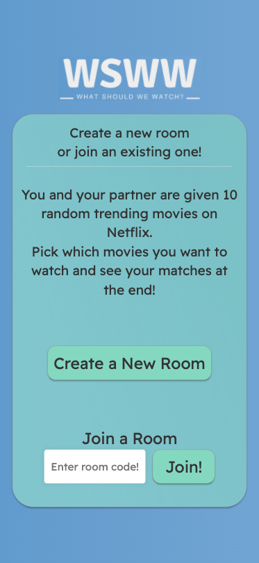
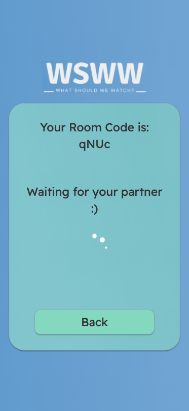
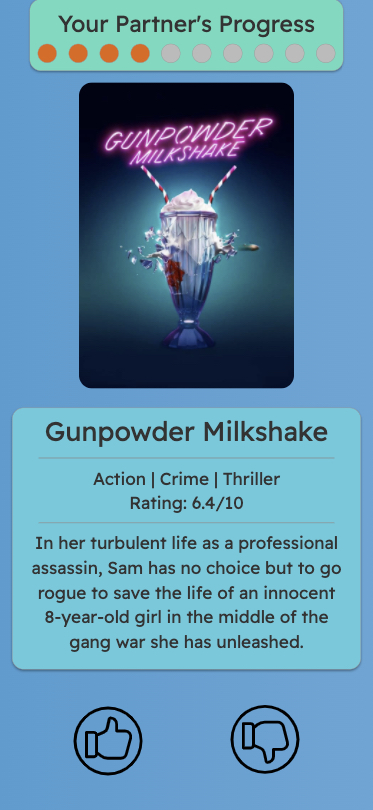

# WSWW (What Should We Watch?)

An app built to minimize the number of times you ask your partner 'What should we watch?'. 

Made with React/Redux, Node.js, Express, and socket.io for real time interactions between clients. 

Designed to be viewed on mobile devices! 

  
  
  

## Deployed Application
https://wsww-app.herokuapp.com/

## Setup

### MacOS/Linux

* `npm install`
* `npm start`

### Windows

* `npm install`
* `npm run build-watch` to start the webpack process
